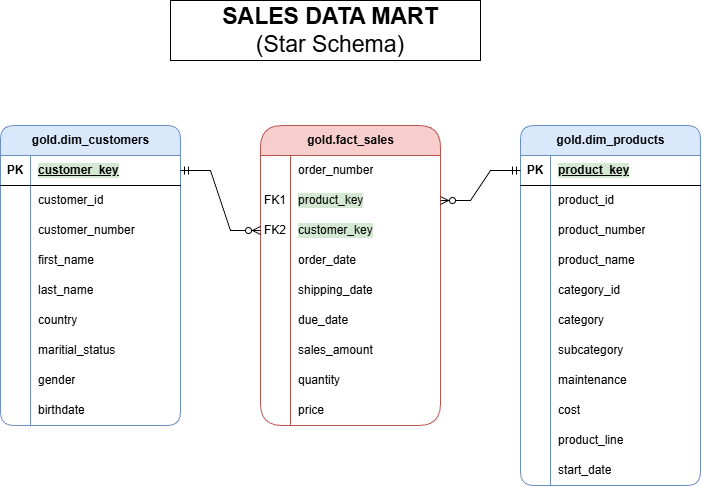

# SQL Data Warehouse Project 🚀

## 📌 Project Overview
This project demonstrates the design and implementation of a **Modern Data Warehouse** using **SQL Server**. The goal is to transform raw data from disparate sources into business-ready insights by following data engineering best practices.

The project covers the entire data lifecycle:
* **ETL/ELT Processes**: Data ingestion and transformation.
* **Data Modeling**: Implementation of a Star Schema (Fact and Dimension tables).
* **Data Analytics**: Creation of a final Gold Layer optimized for business reporting.

---

## 🏗️ Medallion Architecture
The data warehouse is organized into three logical layers to ensure data quality, integrity, and traceability:

1.  **Bronze Layer (Raw)**: Contains raw data imported directly from source files (CSV). No transformations are applied here to preserve the original state.
2.  **Silver Layer (Cleansed)**: Focuses on data cleaning and standardization. This stage handles null values, removes duplicates, and standardizes date formats.
3.  **Gold Layer (Analytical)**: The final layer where data is modeled into a **Star Schema**, specifically designed for consumption by BI tools like Power BI, Tableau, or Excel.

---

## 📊 Data Model (Gold Layer)
The analytical core of the project is the **Sales Data Mart**. As illustrated in the diagram above, the model follows the Kimball methodology:
* **Fact Table**: `gold.fact_sales` (contains quantitative business metrics).
* **Dimension Tables**: `gold.dim_customers` and `gold.dim_products` (contain descriptive attributes).

---

## 📖 Data Catalog (Gold Layer)

The Gold Layer is structured to support high-performance analytical queries. Below are the table definitions:

### 1️⃣ gold.dim_customers
* **Purpose:** Stores customer details enriched with demographic and geographic data.

| Column Name | Data Type | Description |
| :--- | :--- | :--- |
| **customer_key** | INT | Primary Key: Unique surrogate key for each customer record. |
| customer_id | INT | Original unique numerical identifier for the customer. |
| customer_number | NVARCHAR(50) | Alphanumeric identifier used for tracking. |
| first_name | NVARCHAR(50) | Customer's first name. |
| last_name | NVARCHAR(50) | Customer's last name. |
| country | NVARCHAR(50) | Country of residence (e.g., 'Australia'). |
| marital_status | NVARCHAR(50) | Marital status (e.g., 'Married', 'Single'). |
| gender | NVARCHAR(50) | Gender (e.g., 'Male', 'Female'). |
| birthdate | DATE | Date of birth (YYYY-MM-DD). |
| create_date | DATE | Timestamp when the record was created in the system. |

### 2️⃣ gold.dim_products
* **Purpose:** Provides comprehensive information about products and their classifications.

| Column Name | Data Type | Description |
| :--- | :--- | :--- |
| **product_key** | INT | Primary Key: Unique surrogate key for each product. |
| product_id | INT | Internal unique identifier for the product. |
| product_number | NVARCHAR(50) | Structured alphanumeric code for inventory. |
| product_name | NVARCHAR(50) | Descriptive name (includes type, color, and size). |
| category_id | NVARCHAR(50) | Unique identifier for the product category. |
| category | NVARCHAR(50) | High-level classification (e.g., Bikes, Components). |
| subcategory | NVARCHAR(50) | Detailed classification within the category. |
| maintenance_required | NVARCHAR(50) | Indicates if maintenance is needed (Yes/No). |
| cost | INT | Base cost/price of the product. |
| product_line | NVARCHAR(50) | Specific series (e.g., Road, Mountain). |
| start_date | DATE | Date the product became available. |

### 3️⃣ gold.fact_sales
* **Purpose:** Stores transactional sales data for business metric analysis.

| Column Name | Data Type | Description |
| :--- | :--- | :--- |
| order_number | NVARCHAR(50) | Unique order identifier (e.g., 'SO54496'). |
| **product_key** | INT | Foreign Key linking to `gold.dim_products`. |
| **customer_key** | INT | Foreign Key linking to `gold.dim_customers`. |
| order_date | DATE | Date the order was placed. |
| shipping_date | DATE | Date the order was shipped. |
| due_date | DATE | Payment due date. |
| sales_amount | INT | Total monetary value of the sale. |
| quantity | INT | Number of units ordered. |
| price | INT | Price per unit. |

---

## 🛠️ Tech Stack
* **Database**: SQL Server
* **Modeling**: Star Schema (Kimball Methodology)
* **Tools**: SQL Server Management Studio (SSMS), Git

---
